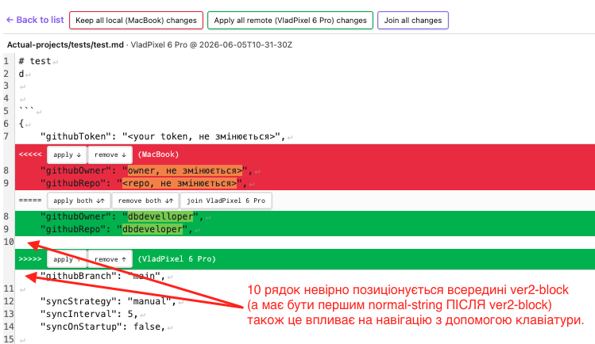
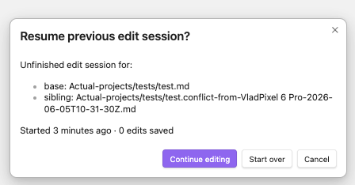
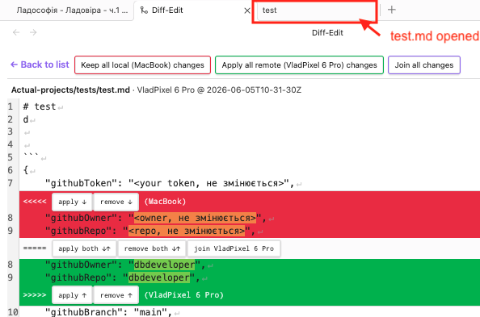
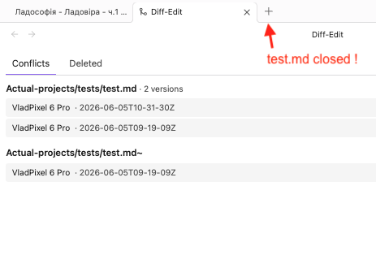
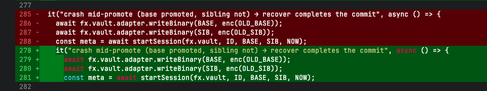
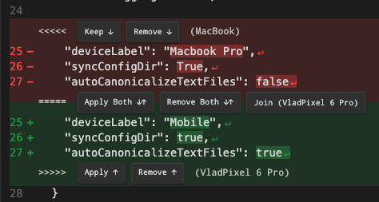
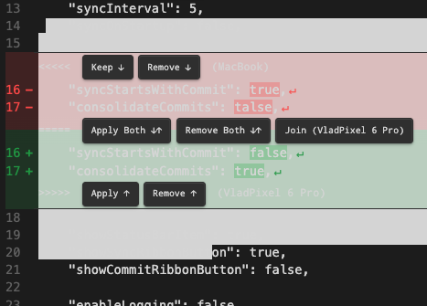
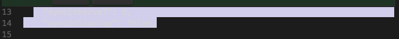
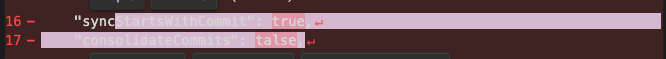

# Покращення DIFF2 Diff-Editor та виправлення існуючих помилок

> В цьому файлі знаходяться завдання, які потрібно виконати для покращення функціоналу Diff-Editor в редакторі коду.

1. ✅ ВИПРАВЛЕНО (2026-06-05). Поглянь на скриншот: . Тут видно, що 10-й рядок невірно позиціонується всередині ver2-block, 
   тоді як мав би бути першим normal-string ПІСЛЯ ver2-block! Ця поведінка зачіпає ВСІ ver2-blocks і рядки після них,
   а також впливає на навігацію з допомогою клавіатури: при натисненні [Down] на рядку 9, курсор потрапляє в рядок 
   з номером 10 (що здавалось би - очевидно!), а потім одразу в 11 (теж логічно), однак нема доступу до рядка без номеру
   з текстом `"githubBranch": "main"`.

   **Root cause (НАШ код, не CM6):** `>>>>>` bottom-маркер у `decorations.ts` — block-widget, прив'язаний до
   `v2.to` (= START наступного `normal`-рядка) з `side:1`. CM6 від цього відрізає ФАНТОМНИЙ порожній
   `diff2-line-common` рядок ПЕРЕД маркером і КРАДЕ `Decoration.line` у реального normal-рядка, що йде далі: той
   рендериться без класу, його gutter-номер зсувається на 1, а moveVertically-навігація його пропускає. ver1
   рендерився чудово, бо top/middle маркери правильно вживають `side:-1` (прив'язка до START контенту → widget
   ВИЩЕ). Bottom був єдиним з `side:1`.
   **Fix:** `decorations.ts` — bottom-маркер тепер `side: bottomAnchor < doc.length ? -1 : 1` (mirror top/middle;
   `side:1` лишається ЛИШЕ для EOL-less групи в кінці документа, де наступного рядка нема). Структура/`computeLineLabels`
   були коректні весь час — баг суто у візуальному рендері. Регрес-тест: `diff-pane-render.test.ts` →
   «normal line after a diff group keeps its line-decoration (no phantom line)». Усі diff2-тести + build зелені.
   **Підтверджено юзером:** порожній рядок-10 був **БІЛИЙ** (= саме той `diff2-line-common` фантом), хоч і
   опинявся візуально всередині зелених ver2-рядків — у sibling реального порожнього рядка НЕМА (variant D). Тобто
   фантом — це ВСЯ проблема; після фіксу він зникає, а `"githubBranch"` стає `common`, нумерується й навігабельний.
   (Geometry-залежні симптоми — зсув gutter-номера + пропуск `[Down]` — випливають з усунення фантома; happy-dom
   їх не відтворює, потрібне фінальне підтвердження на пристрої.)

2. ✅ ВИПРАВЛЕНО (2026-06-05). При відкриванні diff-editor з панелі кожний раз виникає модальне вікно "Resume previous edit session", навіть коли 
   на ній же видно, що "0 edits saved", що - безглуздо. Якщо .diff2-autosave/ створений, але history.jsonl порожній 
   (0 REDO-записив) - потреби в цьому діалозі нема ()

   **Дві окремі причини (обидві пофікшені):**
   **(A) Персистентний stale-dir з порожньою history** (підтверджено реальним `~/Obsidian/.diff2-autosave/tracked-966e…/`
   де `history.jsonl` = 0 байт + лог onload `dirs:1, swept:0`). Юзер відкриває конфлікт → `startSession` створює dir
   (порожня history) → йде геть; `disposeActiveDiffPane` **навмисно лишає dir** для recovery; onload-sweep §4.2 НЕ чистить
   (порожня history НЕ є умовою sweep). Переоткриття → `classifyReopen`=`resume` (бо `joinedDocSha` збігається — він НЕ
   дивиться на глибину history) → модаль «0 edits». **Fix:** `diff-edit-view.ts` `mountDiffPane` у гілках `resume` і
   `restore` тепер: `if (assessHistory(sess.jsonl).empty) { startFreshAndMount(); break; }` (§3.5 — empty = 0 блоків + БЕЗ
   corruption; corrupt-first-block лишається окремим рядком §3.5 і модаль показує).
   **(B) Double-mount у detail-режимі** (пояснює «новий конфлікт»). Коментар у `onOpen` казав «detail-mode: refresh is a
   no-op», але код це НЕ реалізовував: підписка на `ConflictCounter` робила `render()` завжди, а `render()` у detail завжди
   пере-монтує `mountDiffPane`. `subscribe` notify-ить лише при ЗМІНІ count, тож тригер — interval/manual sync, що
   додає/прибирає інший конфлікт під час сесії → count змінюється → `render()` → другий `mountDiffPane` бачить щойно
   створений dir → модаль (а ще й знищує активну сесію редагування). **Fix:** guard підписки — `if (this.viewState.mode ===
   "list") this.render();`.
   **(C) Exit-wipe — ОСНОВНЕ (за уточненням користувача): §4.1.a named invariant.** Сесія варта зберігання ЛИШЕ якщо
   `history.jsonl` має ≥1 запис. 0 записів = нема recovery-цінності + нічого коммітити (`split(fromEditorModel)===inputs`).
   Тому при БУДЬ-ЯКОМУ контрольованому виході 0-запис сесію **мовчки витираємо, НЕ ЧІПАЮЧИ вхідні файли**:
   - `[← back]` з 0 записів → `commitOrDiscardExit` (новий standalone у `exit-commit.ts`) гілка `recordCount===0 → discarded`:
     `rmdir(<id>/)`, БЕЗ commit, БЕЗ `safeRename`-swap (strictly safer — дотично до bug3), тихо в list.
   - покидання інакше (sub-tab switch / закриття view) → `disposeActiveDiffPane` fire-and-forget `rmdir`, якщо
     `activeWriter.currentSeq()===0`. ≥1 запис → dir ЛИШАЄТЬСЯ (recovery; випадкове закриття tab/краш).
   - crash-survivors (вийшли до 1-го запису) → onload sweep §4.2 **cond 2b** (`assessHistory.empty`) + reopen-skip (backstop).
   Реалізація: `exit-commit.ts` (`commitOrDiscardExit`+`ExitOutcome`), `diff-edit-view.ts` (`exitDetailView` use it +
   `disposeActiveDiffPane` wipe), `autosave-cleanup.ts` (cond 2b). Док: DIFF-EDITOR.md **§4.1.a** (named invariant — ВАЖЛИВИЙ
   usecase) + §4.2 cond 2b + §5.1.
   **Тести:** `exit-commit.test.ts` (commitOrDiscardExit: 0→**dir gone + входи байт-ідентичні** + нема staging; >0→commit;
   vault-changed→toctou), `autosave-cleanup.test.ts` (empty→sweep; corrupt-first-block→keep), `reopen-empty-history.test.ts`
   (skip-modal предикат). **584 diff2 + build зелені.**
   **NB:** geometry/ItemView-залежна частина (фактичне НЕ-показування модалі при reopen + re-mount при sync під сесією +
   `disposeActiveDiffPane` через справжній ItemView) — manual confirmation на пристрої (немає mount-харнесу для `DiffEditView`).

3. ✅ ВИПРАВЛЕНО (2026-06-05). Помилка відтворена: Якщо відкрити diff-editor з конфліктом і в цей момент є в tabs вже є відкриті файли, які беруть   
   участь в цьому конфлікті (в нашому випадку це - `test.md` чи 
   `test.conflict-from-VladPixel 6 Pro-2026-06-05T09-19-09Z.md`), а потім внести якісь зміни в ці diff-editor і 
   натиснути `[<-back]`, тоді вже відкритий в звичйаному Obsidian tab файл закриється.
   потрібно вносити зміни в ці файли через modify-in-place. Отже потрібно РЕТЕЛЬНО (з /advisor !) переглянути алгоритм 
   в commit7Step (чи інших місцях) і при записі використовувати modify-in-place є
   (за потреб або завжди, треба вибрати!), так, щоб при відновленні (sweep)
   наш алгоритм відновлення працював ідеально. дивись докази в скриншотах:
    
   
   і 
   
   

   Бачу такі кроки при записі:
   1. пишемо нову версію файлу (тільки в Obsidian Vault, не .<file> і в .<directory>/, які Obsidian в tabs не відкриває!) під назвою `<file>.sync-tmp.<ext>`
   2. пишемо файл-ознаку що файл записано коректно - `.<file>.sync-tmp.<ext>.` (filesize = 0, touch)
   3. копіюємо (in-place) файл з `<file>.sync-tmp.<ext>` в оригінальний файл `<file>.<ext>`
   4. видаляємо тимчасовий файл `<file>.sync-tmp.<ext>`
   5. видаляємо файл-ознаку `.<file>.sync-tmp.<ext>.`
   6. перенесення завершено.

   При відновленні:
   1. після кроку 1. маємо файл `<file>.sync-tmp.<ext>` (можливо не повний!) і маємо оригінальний файл `<file>.<ext>`. Дія - видаляємо тимчасовий файл `<file>.sync-tmp.<ext>`;
   2. після кроку 2 і кроку 3. маємо файли `<file>.sync-tmp.<ext>`, `.<file>.sync-tmp.<ext>.`, `<file>.<ext>`. Дія: копіюємо `<file>.sync-tmp.<ext>` в `<file>.<ext>`. Після чого видаляємо тимчасовий файл
      `<file>.sync-tmp.<ext>` і за ним файл-ознаку `.<file>sync-tmp.<ext>.`;
   3. після кроку 4. НЕ маємо тимчасового файлу `<file>.sync-tmp.<ext>`, маємо файли `<file.<ext>` і файл-ознаку `.<file>.sync-tmp.<ext>.` Дія: видаляємо файл-ознаку `.<file>.sync-tmp.<ext>.`
   4. після кроку 5. - нічого не робимо.

   **РЕАЛІЗОВАНО (Варіант 3 з /advisor — modify-in-place ВБУДОВАНО в `done.json` pair-barrier, НЕ замінює його).**                                                                                               
   Твій per-file протокол — це per-side *запис*; `done.json` лишається координатором *пари*. **Чому pair-barrier                                                                                                 
   ЗБЕРЕЖЕНО (не бездумно):** (1) §5.0 — sequential per-file краш між base і sibling тихо губить ver2-правки;                                                                                                    
   (2) **вирішальне** — onload sync-пульс біжить ПЕРЕД переоткриттям (лог: `onload 12:20:37 → Sync 12:20:42`), тож                                                                                               
   recovery МУСИТЬ завершити пару ДО синку, інакше движок запушить half-committed конфлікт у GitHub (poison на інші                                                                                              
   пристрої).                                                                                                                                                                                                    
   **2 малі зміни:** (a) `commit7Step` — видалено Step 4 (rename original→`.sync-bak` зовсім; `.sync-bak` більше НЕ                                                                                              
   створюється); promote через `promoteInPlace`: existing TFile+`modifyBinary` → IN-PLACE (зберігає tab/cursor/scroll);                                                                                          
   новий файл / `.obsidian/…` (не TFile) / mock → `safeRename(tmp→final)`; (b) `recoverCommit` foreign-guard →                                                                                                   
   `final==="foreign" && tmp!=="tmpNew"` (torn modifyBinary + НАШ clean tmp = roll forward; genuine foreign без tmp =                                                                                            
   fallback). `vault.adapter` скрізь; `modifyBinary` лише для індексованих TFiles ⇒ dot-dirs йдуть adapter-rename.                                                                                               
   **Тести:** `exit-commit.test.ts` (modify-in-place spy + new-file fallback + **config-dir `.obsidian/` commit+recover**);                                                                                      
   `exit-commit-recovery-matrix.test.ts` переписано під modify-in-place (+TB/TS torn-rows) і **параметризовано над                                                                                               
   vault + `.obsidian/` dot-dir** (19×2 = 38). Док: DIFF-EDITOR.md §5.0 Steps 4-7 + §5.0.b; MANUAL-TEST-CHECKLIST bug3.

4. ✅ ВИПРАВЛЕНО (2026-06-05). UNDO/REDO захищають зараз тільки клавіатурні зміни, внесені користувачем. Якщо ж активувати групові операції:                                                                     
   `[apply]`, `[remove]`, `[apply both]`, `[remove both]`, `[join {remote deviceLabel}]`, команди над усім документом:
   `[Keep all local ({local deviceLabel}) changes]`, `Apply all remote ({remote deviceLabel}) changes]`,
   `[Join all changes]`, тоді UNDO (підозрюю, що і REDO також) вже НЕ ПРАЦЮЄ. Це потрібно виправити.
   `undo-redo.test` доводить це **програмно**). Але кожна групова операція приходить через **клік по кнопці** (marker
   `[apply]`/… або toolbar `[Keep all local]`/`[Join all]`), що переносить DOM-фокус на `<button>`. CM6 undo/redo-keymap
   спрацьовує ЛИШЕ коли `.cm-content` має фокус → після кліку `Ctrl/Cmd+Z` не доходить до CM6 і нічого не робить.
   Клавіатурні правки фокус не втрачали — звідси «undo лише для клавіатурних». Тести цього не ловили, бо роблять
   `applyToChunk` + `undo(view)` **програмно** (фокус не задіяний) — класичний «тести зелені, застосунок зламаний».

   **Fix:**

   diff-pane.ts` `dispatchModel` (єдиний choke-point для `applyToChunk` + `resolveAll`) тепер викликає
   `this.view.focus()` після dispatch — покриває і marker-кнопки, і toolbar-команди. 

   **Тести:** 

   `diff-pane-actions.test.ts` — «focus returns to the editor» для `applyToChunk` і `resolveAll` (steal-focus → action→ `view.hasFocus===true`).
   **611 diff2 + build зелені.** 

   **NB:**

   фактичний `Ctrl+Z` після кліку — device/manual (happy-dom не шле keymap), але
   `hasFocus===true` доводить, що keystroke ТЕПЕР дійде до CM6.

5. ✅ ВИПРАВЛЕНО (2026-06-05). UNDO-REDO в самому редакторі (після fix п.4) працюють навіть на різну глибину. ОДНАК (!!!!) ЦЕ ВАЖЛИВО!!!! КОЛИ 
   користувач робить UNDO - ОСТАННІЙ REDO-BLOCK з history.jsonl МАЄ ТАКОЖ ЗНИКНУТИ! Потрібно писати собі десь в
   пам'яті стартове зміщення кожного записаного в history.jsonl REDO-блоку і коли користувач робить undo - робити 
   truncate до цього місця, аж до порожного файлу, якщо користуавач натиснув undo стільки ж разів скільки і було
   внесено змін. Це важливе доповнення - яке варто реалізувати з /advisor і зафіксувати в документах як важливий крок
   алгоритму відновлення. Інакше, в history.jsonl потрапляє занадто багато змін, які можуть зруйнувати документ.
   ДО РЕЧІ: потрібно розширити тести щоб вони робили наприклад 3 зміни, потім 2 undo і потім зберігали і відновлювали 
   документ. В результаті в history.json має бути 1 REDO-блок і при відновленні "накатуватись" ТІЛЬКИ ОДНА ЦЯ ЗМІНА!.

   **РЕАЛІЗОВАНО (з /advisor).** Інваріант: `on-disk block count == CM6 undoDepth == HistoryWriter.liveBlockCount()`.
   - **Runtime:** W2-updateListener — `tr.isUserEvent("undo")` → `onUndo` → `HistoryWriter.truncateLastBlock()` (DROP
     останнього блоку); **redo** + **edit-after-undo** → `onRecord` → append (CM6 чистить redo-стек). З `newGroupDelay:0`
     1 undo = 1 блок.
   - **Count vs stamp:** `liveBlockCount` (live==undoDepth, **синхронний decrement** → `[← back]` exit-wipe одразу бачить
     net-count: N edits + N undos → 0 → **discard, входи недоторкані**) ОКРЕМО від монотонного `seq:`-штампа.
   - **Truncate (нема `truncate`/random-write/positional-append в Obsidian — підтверджено `obsidian.d.ts`):** floor =
     переписати весь файл. `truncateLastBlock` **queue-aware** (блок ще в черзі → `queue.pop()` без I/O і без race з
     pending-flush; інакше — re-read → **`lastIndexOf("\n")` cut + один `slice`, БЕЗ парсингу на N рядків** → `write`).
     **Plain write, НЕ atomicWriteFile/`.sync-bak`** — бо `AtomicWriteRecovery.sweep` розпізнав би `history.sync-bak.jsonl`
     як staging і ВІДНОВИВ би стейл-лог (скасував би truncate). Degrade-safe: torn→trustworthy-prefix; fail→блок не прибрано.
   - **Re-read (не in-memory дзеркало):** resumed-блоки лише на диску → re-read їх бачить.
   - **Тести:** `undo-truncate.test.ts` — 3edits→2undo→1блок+replay; undo-to-empty→0+exit-discard; redo; edit-after-undo;
     undo-into-resumed; **120-step fuzz** з оракулом `blockCount===undoDepth` + replay==live. **617 diff2 + build зелені.**
   - **Док:** DIFF-EDITOR.md **§2.7.a** (+ FUTURE `validCount`-gate для multi-MB — defer до доказів; sentinel-у-лог
     ВІДХИЛЕНО). NB: live `Ctrl+Z`→truncate — device-тест (тести ганяють `applyToChunk`/`undo(view)` програмно).

6. Невеликі зміни в UI:
   1. (особливо на desktop це важливо): При відкриванні diff-editor не видно текстового блимаючого курсора. Потрібно
      клікати мишкою, щоб його побачити. Мало того! - навіть CTRL+Z (UNDO) не працює, поки я мишкою не клікну по тексту
      і не з'явиться курсор!
   2. Схоже не працює відновлення позиції курсора з cursor_{a|b}.json (принаймні я не побачив скролінгу до місця, де я 
      зупинився) або ж це проблема пп.1 вище.
   3. Так як в нас є команда `[Keep all local ({local deviceLabel}) changes]`, тоді якось дивно бачити в ver1-block
      (який по суті означає - local) button `[Apply]`, тоді як вище написано "Keep". Потрібно дотримуватись якоїсь
      консистентності? Тоді я пропоную замінити в ver1-blocks button `[Apply]` на `[Keep]`:
      ```
          | <<<<< [Keep ↓][Remove ↓] ({local deviceLabel})
       1 -| <ours line 1>
       2 -| <ours line 2>
          | ===== [Apply Both ↓↑][Remove Both ↓↑][Join ({remote deviceLabel})]
       1 +| <theirs line 1>
       2 +| <theirs very-long long very-long long very-long longvery-long long
          | very-long long very-long long very-long longvery-long long loooong
          | long line 2>
       3 +| <theirs line 3>
          | >>>>> [Apply ↑][Remove ↑] ({remote deviceLabel}) 
      ```
   4. ЗВЕРНИ УВАГУ на те що назви на кнопках - з "великої букви" і на кнопці
            "join ({remote deviceLabel})" - remote deviceLabel в дужках: "()".

   5. В прикладах було явно показано, що в gutter ver1 НАВПРОТИ КОЖНОГО РЯДКА (незалежно, чи це фізичний рядок (який 
      закінчується `\n`) чи це віртуальний рядок (більший рядок на екрані розбився на кілька рядків) - явно має бути 
      вказано символ '-' (мінус), а в ver2 - символ '+' (плус), як на прикладі вище.  
   
   6. Чи можна фон розділюючого рядка між ver1 і ver2 blocks також розфарбувати? Але не просто, а "хитро": нижню половину
      цього рядка намалювати кольором ver2 (зеленим), а верхню - кольором ver1 (червоним) також розфарбувати? Але не 
      просто, а "хитро": нижню половину цього рядка намалювати кольором ver2 (зеленим), а верхню - кольором ver1 
      (червоним)? Бо поки він білий, він сильно відволікає фокус погляду.

   7. Чи можна gutter навпроти блоків ver1 і ver2 також фарбувати в їх кольори? Щоб нумерація і фон під нею також була 
      в кольорах відповідних ver-блоків? Як тут: 
      
      ЗАУВАЖЕННЯ: Obsidian підтримує "світлу" і "темну" теми? Якщо так, нам потрібно буде також мати два набори 
      кольорів для diff-editor: для світлої теми фон ver1 має бути світло рожений, а ver2 - світло-салатовий (зелений),
      колірв тексту в цих blocks - чорний. Для темної теми кольори мають бути такі ж, як на ./imgs/screenshots-1.png 
      (див. вище)). І гліф `↵` малювати кольором цих цифр з glitter в групах ver1/ver2.

      Різні відтінки червоного і зеленого можна використовувати для малювання цифр рядків і +/- в gutter, як на 
      скриншоті src/tasks/imgs/screenshots-1.png — там видно світлі цифри й +/- на темному фоні (для темної теми),
      а для світлої теми можна зробити навпаки — світлі кольори використати як фони, а фони з темної теми використати 
      як колір цифр та +/- у світлій темі.

   **✅ ВИПРАВЛЕНО (2026-06-05) — усі 7 підпунктів:**
   1. **Focus on mount:** DiffPane не фокусувався при відкритті → нема курсора, Ctrl+Z не працює до кліку. **Fix:**
      `DiffPane.focus()` (метод; НЕ в конструкторі — focus мід-конструкції планує measure, що падає «update in progress»
      на наступному dispatch'і), `mountDiffPane` кличе його після КОЖНОГО mount-шляху.
   2. **Cursor restore:** `setCursor` ставив `scrollDOM.scrollTop` ДО першого measure (не застосовувався). **Fix:**
      `EditorView.scrollIntoView(anchor)` (CM6 застосує після measure) + `view.focus()` (відновлений курсор у фокусі).
   3. **ver1 `[Apply]`→`[Keep]`** (ver1=local→Keep, дзеркалить `[Keep all local]`); ver2 лишається `[Apply]`.
   4. **Capitalize** усіх міток + `join`→`Join (deviceLabel)`.
   5. **Gutter `−`/`+`** (ver1=`−`, ver2=`+`) — раз на ЛОГІЧНИЙ рядок зверху (wrapped-continuation: лише кольоровий
      gutter; узгоджено з користувачем — CM6 gutter per-logical-line).
   6. **Роздільник `=====`** — split-gradient (верх ours-червоний / низ theirs-зелений) замість білого.
   7. **Кольоровий gutter** — cell-фон = колір сторони + насичені цифри/гліф; `↵` теж. Theme-aware автоматично.

   **КОЛІРНА ДОРОБКА (за фідбеком — фінал, DIFF-EDITOR.md §1.11):** усі кольори — **CSS-змінні** на
   `.diff2-edit-view-root` (overridable):
   - `--diff2-*-bg` (subtle 16% tint) → фон ver-рядків **+ маркер-рядків `<<<<<`/`=====`/`>>>>>`** (той самий колір, одна
     смуга) **+ gutter-cells** (рядків і маркерів через `widgetMarker`/`MarkerGutterMarker`).
   - `--diff2-*-fg` (насичений `#f85149`/`#2ea043`) → gutter-цифри+`±`+`↵` (контраст до tint — фікс «червоне на червоному»,
     коли Obsidian-вари давали однаковий колір fg/bg); текст+бордер toolbar-кнопок.
   - `--diff2-*-strong` (30%) → **word-diff** (змінені фрагменти, замість жовтого) + **hover** marker/toolbar-кнопок.
   - Каретка `caret-color: --text-normal` (bare-CM6 не успадковує → була чорна-невидима в dark). Маркер-текст
     `--text-normal` (білий-на-світлому був невидимий). `.cm-gutters` transparent (default-фон просвічував білим у dark).
   - Toolbar: `[Keep all RED/GREEN changes]` (короткі, кольорові, hover `-strong`, повний `(deviceLabel)` у `title`);
     marker-кнопки gap ≥5px.
   8. **✅ `↵` лише в ver-блоках** (не на normal — був шум), кольором сторони. `decorations.ts`: `verLines` Set зі
      `structure`. §1.6.a.1 переписано. Тест `newline-glyph.test.ts` оновлено (гліф лише на ver-рядках).
   9. **✅ `↵` у виділенні (TODO §6.9):** нативне виділення лишало trailing `↵`-widget поза підсвіткою →
      `drawSelection()` extension (`diff-pane.ts`) малює фон сам, продовжуючи до кінця рядка. §1.11 оновлено.

   **Реалізація:** `diff-pane.ts`, `diff-edit-view.ts`, `markers.ts`, `line-numbers.ts`, `decorations.ts`, `styles.css`.
   **Тести:** `diff-pane-render.test.ts` (focus/setCursor/gutter), `newline-glyph.test.ts`. **622 diff2 + build зелені.**
   Док: DIFF-EDITOR.md §1.6.a.1, §1.9, §1.10, **§1.11 (колірна схема)**.
   **NB (device — happy-dom не рендерить CSS/layout/block-widget-gutter):** підтверджено користувачем на пристрої
   (світла+темна): кольори, gutter-смуга на маркерах, hover-кнопок, word-diff, каретка, `↵` лише в ver. ✅

   8. В normal-strings - глів `↵` не малювати. Я не побачив у ньому якусь користь. Малюємо тільки в ver1/ver2-блоках 
      кольором номерів рядків і +/- в glitter

7. ✅ ВИПРАВЛЕНО (2026-06-05). Підрахунок конфліктів в іконках і меню (3) - підраховує тільки tracked conflicts і не враховують synthetic, тоді як
   в diff-panel їх може бути більше і це може конфузити користувача.

   **Root cause:** `ConflictCounter.computeCount` (sync2) ітерував лише `store.getAll()` (tracked), а diff-panel —
   `findAllConflicts(vault, store)` (diff2), що повертає tracked **+ synthetic** (`*.conflict-from-*` siblings без
   record). Лічильник годує ribbon-badge + status-bar + меню → вони недораховували. **Обмеження:** sync2 НЕ сміє
   імпортити diff2 (CLAUDE.md), а `findAllConflicts`/`parseSiblingFilename` — у diff2.
   **Fix (ін'єкція через main.ts — поважає шар):**
   - `conflict-counter.ts`: опціональний `countConflicts?: () => number` у deps; `computeCount` використовує його якщо
     заданий (інакше — стара store-логіка, для тестів). `main.ts` передає
     `() => findAllConflicts(vault, store).entries.length` → count **==** diff-panel.
   - `conflict-watcher.ts`: `isRelevant` += `path.includes(".conflict-from-")` — інакше створення/видалення SYNTHETIC
     sibling (юзер перемістив пару в нову теку / видалив synthetic) НЕ тригерило recompute → badge ставав stale.
   **Тести:** `conflict-counter.test.ts` (injected countConflicts override), `conflict-watcher.test.ts` (synthetic-path →
   markDirty). **1383 unit + build зелені.** drain-логіка (`consumeSweepRequest`) не зачеплена — count і sweep незалежні.

8. ✅ ВИПРАВЛЕНО (2026-06-05, підтверджено на пристрої). ESC закриває diff-editor — це неприпустимо! З клавіатури закривати це вікно... поки що взагалі НЕ БУДЕМО.

   **Уточнення:** ESC не закривав, а **перемикав фокус** на останній markdown-таб (Obsidian-default «ESC → фокус на
   редактор»; коли diff-editor єдиний таб — ESC нічого не робив). **Fix:** `DiffEditView` — Obsidian `Scope`
   (`register([], "Escape", () => false)`), pushed/popped за `active-leaf-change` (активний ЛИШЕ коли diff-editor —
   активний leaf, тож ESC в інших табах працює). Scope перехоплює через ВЛАСНИЙ keymap-dispatch Obsidian → раніше за
   вбудований handler (DOM-capture listener програв його фазі — відкинуто). Device-only (нема юніт-харнесу для keymap).
   **#8b (виявлено при тестуванні, виправлено):** після перемикання diff-editor → markdown-таб → назад курсор зникав
   (Obsidian ре-фокусує MarkdownView при активації leaf, але не наш ItemView). Fix: у тому ж `active-leaf-change` хендлері
   — `if (leaf === this.leaf) this.activeDiffPane?.focus()`. Підтверджено на пристрої. (Box-курсор як у Obsidian —
   зʼясувалось, це Vim navigation-mode, не дефолт; запит знято.)

9. ✅ ВИПРАВЛЕНО (2026-06-05, підтверджено на реальному файлі). Цікаве спостереження: коли розв'язуєш конфлікт через кнопки чи hotkey (Ctrl+Enter, наприклад) - збивається позиція
   курсора. Він знову вказує на позицію 0,0. А (на мою думку), мав би вказувати) або на той самий символ де стояв до
   вирішення конфлікту, або (навпевне краще і легше реалізувати) - на перший символ вирішеного конфлікту. Тобто:
   1. якщо конфлікт вирішено на користь ver1-block -тоді стояти в позиції 0 першого нормального рядка, отриманого з ver1
   2. якщо конфлікт вирішено на користь ver2-block -тоді стояти в позиції 0 першого нормального рядка, отриманого з ver2
   3. якщо конфлікт вирішено на користь apply both чи join  - те ж що і п.9.1
   4. якщо конфлікт виріщено на користь delete both - тоді на позиції 0 першого нормального рядка ЗА вирішеним методом 
      видалення diff-string

   **РЕАЛІЗОВАНО (з /advisor).** Курсор → **початок вирішеної групи** (offset першого сегмента групи; текст ДО групи
   незмінний → offset зберігається в новому doc; clamp). Це покриває всі підпункти 9.1-9.4 одним правилом (початок
   вирішеного контенту). `diff-pane.ts`:
   - `applyToChunk` (per-chunk: marker `[Keep]`/`[Apply]`-кнопки + hotkeys) — курсор на `min(from)` сегментів групи.
   - `resolveAll` (bulk toolbar `Keep all RED/GREEN`) — курсор на ПЕРШУ вирішену групу (`min from` усіх ver-сегментів).
   - **Окрема selection-only транзакція** ПІСЛЯ `dispatchModel`: inline-selection збурював filter-pipeline (collapseGuard
     re-tiling) і міняв ЗАПИСАНИЙ блок. **Insight (advisor):** структура в history-блоці залежить від курсора при record
     (collapseGuard→growIndexFor→mapStructure), АЛЕ replay ставить структуру НАПРЯМУ через setDiffPaneState і не
     перезапускає growIndexFor → replay faithful незалежно від курсора.
   - **Safety-check (advisor):** жодна production docChanged-без-setDiffPaneState транзакція не диспатчиться НЕ на
     курсорі (free-typing/paste — на курсорі; `normalizeGuard` редагує `left.to`, але collapseGuard бере oldHead
     **усередині** `left` → той самий сегмент). Тести `history-replay`/`diff-pane-replay` оновлено на click-then-type
     (реалістично: edit завжди на курсорі). **1384 unit + build зелені.**

10. ✅ ВИПРАВЛЕНО (2026-06-06). Ця ж проблема є і при UNDO/REDO цих розв'язків але не в реальному сеансі редагування, а після відновлення після збою.
    Курсор веде себе безладно, і часто знову опиняється в позиції 0,0. Можливо потрібно записувати в REDO-блоки ще й
    позицію курсора відносно блоку? і при відновленні десь відновлювати і позиції курсору в UNDO/REDO in-memory stack?

    **Підхід — SYNTHETIC caret (за пропозицією користувача), БЕЗ запису в блок** (формат §2.6 + checksum НЕ зачеплено —
    критично: косметичне значення курсора НЕ сміє труїти crash-recovery довіру, яку гартували в #5). `replayHistory`:
    кожен replayed-блок дістає `selection` = **наступний символ після зміни** (`toB`; якщо там `\n` → 0-та поз.
    наступного рядка). Деривується з самого change. Ці курсори потрапляють у **CM6-undo-стек** (кожен `state.update` =
    крок), тож після recovery: REDO → синтетична поз., UNDO → selection попереднього кроку. Фінальний курсор:
    `cursor.json` (primary, `setCursor` #6.2) АБО синтетичний-останнього-блоку (fallback). Chunk-action = full-replace →
    `toB` = кінець doc (детерміновано, не 0,0; не resolved-group як у живому #9 — наслідок synthetic-підходу).
    **Oracle (advisor):** undo-after-replay тест тепер перевіряє ще й `selection.main.head` через всю траєкторію.
    Док: DIFF-EDITOR.md §3.3. **623 diff2 + build зелені.**

11. Пошук змін між фрагментами ver1/ver2 працює не точно. Дивись приклад:
    
    наприклад:
    - в ver1 маємо рядок `26 -    "syncConfigDir": True,"`
    - в ver2 маємо рядок `26 -    "syncConfigDir": true,"`
    Виділено в ver1 УСЕ СЛОВО "True", а в ver2 - УСЕ СЛОВО "true", однак між цими двома рядками різниця тільки на
    одну букву! - "Т" vs "t"!  Чи можна налаштувати цей алгоритм виявлення змін так, щоб він точніше визначав 
    різницю між рядками?
    Ще один приклад з цього ж скриншоту:
    - в ver1 маємо рядок `27 -    "autoCanonicalizeTextFiles": false"`
    - в ver2 маємо рядок `27 -    "autoCanonicalizeTextFiles": true"`
    Різниця в "fals" vs "tru" (фінальне "e" в них спільне). Однак тут ще дивніша ситуація, бо до цих змінених зон
    чомусь ще й потрапив гліф `↵`.

12. Хочу напис на кнопці в diff-string (`==== ... [ Join ({remote deviceLabel}) ]`) замінити на коротшу: `[ Join ↓↓ ]`  

13. вирішення конфлікту через `[join]` створює такий рядок: (див. [скриншот](./imgs/bug-9.png)):
    ```
    > Changes from `VladPixel 6 Pro` at `2026-06-05T10-31-30Z`:
    >
    >     "githubOwner": "dbdeveloper",
    >     "githubRepo": "dbdeveloper",
    ```
    я б хотів внести певні зміни:
    1. забрати порожній другий рядок (якщо фізично він буде присутній в ver2, тоді й з'явиться).
    2. дату писати не в ``, а як нормальну дату: 
    ```
    > Changes from `VladPixel 6 Pro` at 2026-06-05 10:31:30:
    >     "githubOwner": "dbdeveloper",
    >     "githubRepo": "dbdeveloper",
    ```
14. проблема кольору selection в dark-mode. В light-theme все видно чудово, в dark-mode - жах:
    - light-mode:

       
    
    - dark-mode:

      

      

      

    Поверни ті кольори, які були до твоїх правок selection (TODO §6.9)

15. 